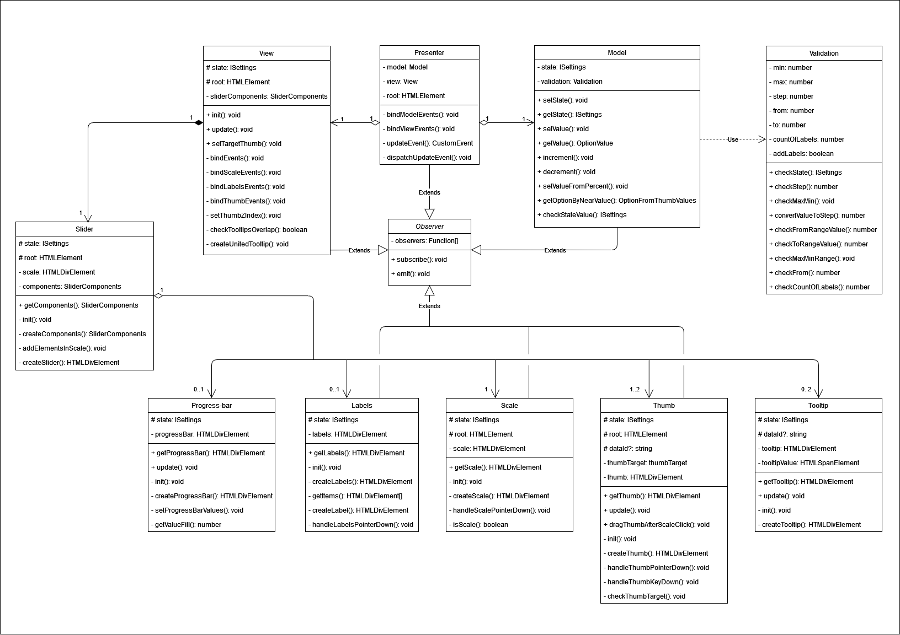

# MetaLamp 4 task - Slider for jQuery

Четвертое задание - [JQuery](https://jquery.com) плагин, реализующий функционал `range-slider`, который позволяет перетягиванием задавать числовое значение в определенном диапазоне.

[Демо страница](https://anvyden.github.io/slider-plugin/) для тестирования возможностей слайдера.

## Содержание

- [`Возможности`](#возможности)
- [`Архитектура`](#архитектура)
- [`Развертывание`](#развертывание)
- [`Подключение слайдера и использование`](#Подключение-и-использование-слайдера)
- [`API`](#API)
- [`UML-диаграмма`](#UML-диаграмма-классов)
- [`Сторонние инструменты`](#Сторонние-инструменты)

## Возможности

 - Два типа слайдера (одиночный и диапазон)
 - Поддержка отрицательных значений
 - Любое количество слайдеров на странице
 - Поддержка тач-устройств
 - Поддержка с клавиатуры
 - Адаптируется под изменения ширины/высоты контейнера
 - Кастомизация:
   - Задание размера шага
   - Возможность задать диапазон значений
   - Горизонтальный или вертикальный вид
   - Возможность вкл/откл прогресс-бар
   - Возможность вкл/откл подписи под шкалой значений
   - Возможность задать количество подписей под шкалой значений
   - Возможность вкл/откл подписи над ползунками

## Архитектура

Данный плагин выполнен по `MVP-архитектуре` с Passive View. Благодаря этому, бизнес-логика слайдера отделена от его отображения. Для осуществления такой архитектуры используется паттерн `Observer`, который позволяет взаимодействовать модулям между собой, ничего не зная друг о друге.

### Model

**Model** - модуль, отвечающий за бизнес-логику всего приложения. Он хранит все состояния приложения и осуществляет валидацию данных. Имеет методы для чтения и записи (всего состояния приложения или каждого параметра по отдельности), и методы для обработки значений слайдера, как в численном значении, так и в процентном, полученных от `View`, для обновления состояния приложения. 

### View

**View** - модуль, отвечающий за отображение слайдера, обновление его внешнего вида и взаимодействие пользователя с ним.
Основной модуль `View` декомпозирован на более мелкие компоненты `subView`. С помощью абстрактного класса `Observer`, некоторые компоненты подписываются на события изменения состояния приложения. Это позволяет `subView` быть низкоуровневыми компонентами, ничего незнающими о более высоком уровне, но при этом всегда иметь доступ к актуальному состоянию и производить обновление своего отображения.

Все `subView` обладают схожим интерфейсом: каждый компонент создает свой элемент, добавляет слушателей и сообщает о своих изменениях другим, подписанным, компонентам. Также может обновлять свои отдельные части без полной перерисовки.

Для инициализации/перерисовки графической части используется класс `Slider`, в котором инициализируются и хранятся все компоненты `subView`, что позволяет `view` легко взаимодействовать с `subView` с помощью паттерна `Observer`.

Класс `View` умеет прослушивать события `subView`, а также имеет несколько методов:
 - методы `checkTooltipsOverlap()` и `createUnitedTooltip()` проверяет перекрытие между подписями над ползунками и создает одну общую подпись.
 - метод `setThumbZIndex()` меняет свойство `z-index` у ползунков в зависимости от того, какой в данный момент является активным.
 - метод `setTargetThumb()` передает `target` при клике по шкале, позволяя сразу передвигать ползунок.

### Presenter
**Presenter** - модуль, который имеет зависимости от других модулей приложения.

`Presenter` выполняет несколько функций:
+ Создает `model` и `view`
+ Подписывается на изменения `model` и `view`
+ Реагирует на обновление `model` и обновляет `view`
+ Реагирует на обновление `view` и обновляет `model`
+ Создает кастомное событие `update`, которое позволяет получать актуальное состояние приложения и осуществлять логику при изменении состояния слайдера.

Передача данных снизу вверх осуществляется следующим образом: `subView` -> `View` -> `Presenter` -> `Model`

## Развертывание

### Клонирование репозитория

```bash
  git clone https://github.com/anvyden/slider-plugin.git
```

### Команды

| Установка зависимостей | Development сборка | Production сборка | Тестирование |    Покрытие тестами     |
|:----------------------:|:------------------:|:-----------------:|:------------:|:-----------------------:|
|     `npm install`      |   `npm run dev`    |  `npm run build`  |  `npm test`  | `npm run test:coverage` |

## Подключение и использование слайдера 

1. Для работы плагина необходимо подключить `JQuery-3.x`
2. Для подключения плагина необходимо взять из папок `./dist/assets/js` и `./dist/assets/css` файлы:
   - `plugin.js`
   - `plugin.css`

*Пример подключения:*
```html
<html>
  <head>
     ...
     <!--JQuery-->
     <script defer='defer' src='https://code.jquery.com/jquery-3.6.0.min.js'></script>
     <!--JavaScript file-->
     <script defer='defer' src='plugin.js'></script>
     <!--Styles file-->
     <link href='plugin.css' rel='stylesheet' />
  </head>
</html>
```

*Инициализация с настройками по умолчанию:*
```html
   <!--HTML-->
   <body>
     ...
     <div id='root'></div>
   </body>
```
```js
   /* JavaScript */
   $('#root').sliderPlugin()
```

*С пользовательскими настройками:*
```js
   $('#root').sliderPlugin({
      max: 200,
      min: -200,
      step: 20,
      from: -100,
      to: 120,
      isRange: true,
      orientation: 'vertical',
      color: 'purple',
      hasTooltips: true,
      hasProgressBar: true,
      labels: {
         addLabels: true,
         countOfLabels: 6,
      },
   })
```

*Инициализация с настройками через data-атрибуты:*
```html
   <!--HTML-->
   <body>
     ...
     <div
      id='root'
      data-props={
         max: 200,
         min: -200,
         step: 20,
         from: -100,
         to: 120,
         isRange: true,
         orientation: vertical,
         color: purple,
         hasTooltips: true,
         hasProgressBar: true,
         labels: {
            addLabels: true,
            countOfLabels: 6,
         },
      }
     ></div>
   </body>
```
```js
   $('#root').sliderPlugin()
```

### Параметры слайдера

|      Опции       |   Тип   |  По-умолчанию  |                                                                 Описание                                                                 |
|:----------------:|:-------:|:--------------:|:----------------------------------------------------------------------------------------------------------------------------------------:|
|      `min`       | number  |      `0`       |                                                        Минимальное значение шкалы                                                        |
|      `max`       | number  |     `100`      |                                                       Максимальное значение шкалы                                                        |
|      `step`      | number  |      `10`      |                                                                Шаг шкалы                                                                 |
|      `from`      | number  |      `20`      |                                         Значение одиночного ползунка / Начальное знач. диапазона                                         | 
|       `to`       | number  |      `50`      |                                                       Конечное значение диапазона                                                        |
|  `orientation`   | string  | `'horizontal'` |                                                Ориентация слайдера (horizontal/vertical)                                                 |
|     `color`      | string  |   `'orange'`   |                                                       Цвет слайдера (purple/green)                                                       |
|    `isRange`     | boolean |     `true`     |                                                    Тип слайдера (одиночный/диапазон)                                                     |
| `hasProgressBar` | boolean |     `true`     |                                           Заливка (от `min` до `from` либо от `from` до `to`)                                            |
|  `hasTooltips`   | boolean |     `true`     |                                               Отображение текущего значения над ползунком                                                |
|     `labels`     | object  |     -----      |                                       Содержит в себе два свойства: `addLabels` и `countOfLabels`                                        |
|   `addLabels`    | boolean |     `true`     |                                                          Подписи шкалы значений                                                          |
| `countOfLabels`  | number  |      `6`       | Количество подписей шкалы значений. Можно задать от 2 до 6, если значение не попадает в этот диапазон, то ставится значение по умолчанию |

## API

Плагин принимает в качестве параметров объект с опциями, либо методы для изменения и получения данных.

`getState(): ISettings` - метод, который возвращает текущее состояние слайдера в виде объекта.

```js
   const state = $('#root').sliderPlugin('getState')
   console.log(state) // { min: 0, max: 100, step: 10, from: 20, to: 50, orientation: 'horizontal', ...}
```
---
`getValue(option: string): string | number | boolean` - метод, который возвращает текущее значение параметра слайдера.

```js
   const max = $('#root').sliderPlugin('getValue', 'max')
   const color = $('#root').sliderPlugin('getValue', 'color')
   const labels = $('#root').sliderPlugin('getValue', 'addLabels')
   console.log(max) // 100
   console.log(color) // 'green'
   console.log(labels) // true
```
---
`setValue(option: string, value: number | string | boolean ): void` - метод для изменения любого значения состояния слайдера. Принимает название параметра `string` и значение типа `string` | `number` | `boolean`.

```js
   $('#root').sliderPlugin('setValue', 'min', -250)
   $('#root').sliderPlugin('setValue', 'max', 250)
   $('#root').sliderPlugin('setValue', 'step', 25)
   $('#root').sliderPlugin('setValue', 'from', -125)
   $('#root').sliderPlugin('setValue', 'to', 200)
   $('#root').sliderPlugin('setValue', 'orientation', 'vertical')
   $('#root').sliderPlugin('setValue', 'color', 'purple')
   $('#root').sliderPlugin('setValue', 'isRange', false)
   $('#root').sliderPlugin('setValue', 'hasProgressBar', false)
   $('#root').sliderPlugin('setValue', 'hasTooltips', true)
   $('#root').sliderPlugin('setValue', 'addLabels', true)
   $('#root').sliderPlugin('setValue', 'countOfLabels', 4)
```

### Кастомное событие

`bindListener(eventName: string, func: EventCallback): void` - метод, который принимает название `event` и позволяет передать callback функцию при срабатывании этого события.

Возможные `events`, на которые можно добавить callback функцию:
 + `update` - срабатывает при изменении состояния слайдера. Имеет объект `detail`, содержащий текущее состояние слайдера.

```js
   $('#root').sliderPlugin('bindListener', 'update', () => {
     `any code`
   })
```
```js
   $('#root').sliderPlugin('bindListener', 'update', (event) => console.log(event.detail))
   /* { min: 0, max: 100, step: 10, from: 20, to: 50, orientation: 'horizontal', ...} */
```

## UML диаграмма классов


[Открыть диаграмму в draw.io для удобного просмотра](https://viewer.diagrams.net/?tags=%7B%7D&target=blank&highlight=0000ff&edit=_blank&layers=1&nav=1&title=slider-plugin.drawio.png#Uhttps%3A%2F%2Fraw.githubusercontent.com%2Fanvyden%2Fslider-plugin%2Fmaster%2FUML%2Fslider-plugin.drawio.png)

## Сторонние инструменты

- [Typescript 4](https://github.com/microsoft/TypeScript/#readme)
- [Webpack 5](https://github.com/webpack/webpack)
- [Babel 7](https://github.com/babel/babel)
- [Jest 27](https://github.com/facebook/jest)
- [jQuery 3.6](https://github.com/jquery)
- [ESLint 8](https://github.com/eslint/eslint)
- [Stylelint 14](https://github.com/stylelint/stylelint)
- [Cross-env 7](https://github.com/kentcdodds/cross-env)
